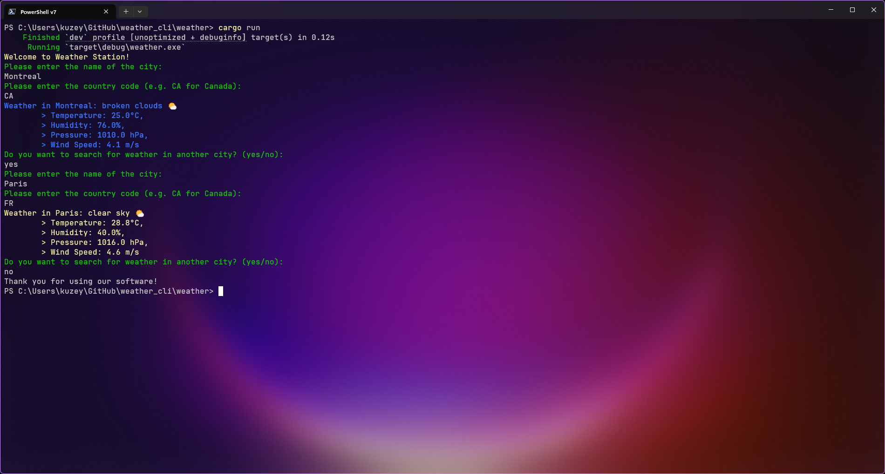

# 🌦️ weather-cli

A simple and colorful terminal-based Weather CLI app written in Rust, using the OpenWeatherMap API.  
It fetches real-time weather data for any city and displays temperature, humidity, pressure, and wind speed with emoji and color enhancements.

---



## ✨ Features

- 🌍 Search by **city and country code**
- 🎨 **Color-coded** weather output with **emoji indicators**
- 🌡️ Displays:
    - Weather description
    - Temperature (°C)
    - Humidity (%)
    - Pressure (hPa)
    - Wind speed (m/s)
- 🔁 Option to look up multiple cities in one session

---

## 📦 Dependencies

- [`reqwest`](https://crates.io/crates/reqwest) – for making HTTP requests
- [`serde`](https://crates.io/crates/serde) – for JSON deserialization
- [`colored`](https://crates.io/crates/colored) – for terminal color formatting

---

## 🚀 Getting Started

### 1. Clone the project

```bash
git clone https://github.com/meenbeese/weather-cli.git
cd weather-cli
```

### 2. Add your OpenWeatherMap API key

Edit the line in `main.rs`:
```rs
let api_key: &str = "your_api_key_here";
```
You can get a free API key from <https://openweathermap.org/api>.

### 3. Build and run the app
```bash
cargo run
```

## 📄 License
MIT License © 2025 Kuzey Bilgin
